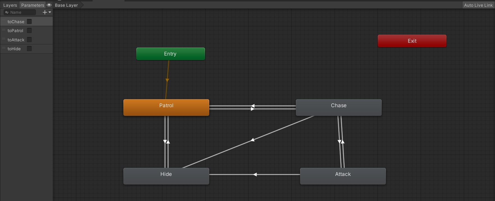

# Maquina Estado Finito
## Modifica el proyecto de Línea de Visión para hacer que el NPC se controle a través de una máquina de estados. Los estados son:

## Patrol: implementa el método "wander". Si el jugador entra en el campo de visión del agente pasa el estado "Chase".

Primero añadimos un nav mesh al mapa, algunos obstáculos y hacemos Bake, para controlar al robot le añadimos tambien un componente nav mesh agent.

Para crear la máquina de estados, creo un animation controller Añadiendo un estado Patrol y con un Behaviour Wander.
Desde aquí en OnStateEnter(), simplemente decido una ubicación aleatoria en el plano XZ del mapa y le digo al agente que vaya a ese destino.
En OnStateUpdate(), compruebo la distancia del agente hasta el punto seleccionado, si esta es menor que 3 elijo una nueva ubicación aleatoria.
Aparte calculo una distancia y un ángulo respecto al jugador, en caso de que se cumpla una visión de distancia y de ángulo mínima, cambio al estado Chase.

-> GIF de ejemplo de Patrol:

## Chase: implementa "Seek" o "Pursue" para seguir al jugador. Si el jugador está dentro de la distancia de tiro pasa al estado "Attack". Si el jugador deja de estar en el campo de visión, pasa al estado "Patrol".

Añadimos un estado Chase con el Behaviour Seek.
En OnStateUpdate() actualizamos el destino del agente a la posición del jugador y vamos calculando su distancia respecto al jugador.

Si la distancia es mayor que un Umbral (20 en este caso) el robot pasará al estado Patrol:

Y si la distancia es menor que un Umbral (10), el robot pasará al estado Attack:

## Attack: dispara al jugador. Si la distancia con el jugador es superior a la distancia de tiro, pasa al estado "Chase". Si la vida del NPC está por debajo de una cantidad, pasa al estado "Hide".

Añadimos un estado Attack con el comportamiento de ataque.
En este estado simplemente se cambia la animación a la de ataque (no esta implementado que nos dispare), y en OnStateUpdate() cuando nos alejamos cierto Umbral (12), vuelve al estado Chase.
Si la vida del robot es menor que 4 pasa al estado Hide (El jugador si puede dispararle para bajarle la vida).

-> GIF de ejemplo de Attack:

## Hide: implementa el método "Hide" o "CleverHide" y regenera la vida del NPC. Si la vida está por encima de un valor, pasa al estado "Patrol".

Añadimos un estado Hide con un comportamiento para esconderse.
En el script World, tenemos una lista de los objetos donde el robot puede esconderse (buscando los objetos con la etiqueta "hide").
En el OnStateUpdate() de Hide recorremos toda la lista de objetos donde puede esconderse el robot, calculamos la dirección respecto al jugador de cada lugar de escondite y una distancia para el escondite. De todos los escondites, buscamos el que tenga la distancia menor y la elegimos como el escondite donde el robot va a esconderse.
Mientras se encuentre en Hide, el robot recuperará su vida cada 3 segundos, cuando su vida se recupera al máximo (10) vuelve al estado Patrol.
Actualizamos todos los estados para que cuando el robot tenga 4 o menos de vida, pase al estado Hide.

-> GIF de ejemplo de Hide:

-> Diagrama de los estados Patrol, Chase, Attack y Hide:

